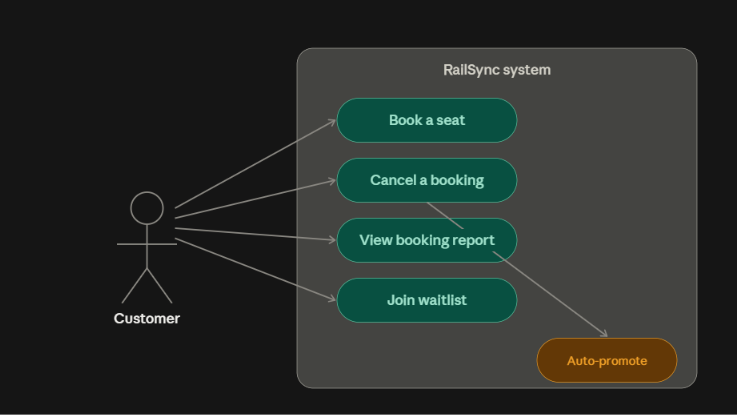
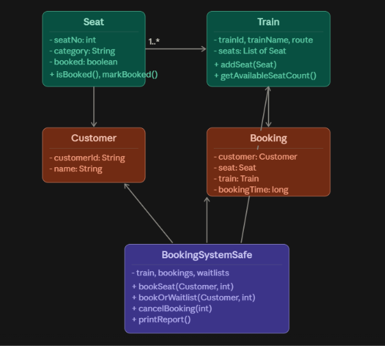

# RailSync — Concurrent Train Ticket Booking Rush System

RailSync is a console-based Java application that simulates a high-demand train ticket booking rush (similar to IRCTC's tatkal booking window), where multiple customers attempt to book the same limited seats at the same time.

The project demonstrates a real, well-known class of software bug, the **race condition**, by first showing it happen in an unsynchronized booking engine, then fixing it using Java's `synchronized` keyword. It also includes a waitlist system with automatic seat reassignment on cancellation.

## Problem Statement

When multiple users try to book the same seat simultaneously, a naive booking system can incorrectly allow more than one booking to succeed for a single seat which is a bug that has affected real booking platforms at scale. RailSync demonstrates:

1. The bug occurring in an unsynchronized implementation (`BookingSystemUnsafe`)
2. The fix using proper synchronization (`BookingSystemSafe`)
3. A complete booking system with waitlisting, cancellation, and reporting

## Features

- Seat and train management
- Thread-safe concurrent seat booking
- Waitlist queue with automatic promotion on cancellation
- Booking cancellation
- Booking reports (seat status, waitlist size, confirmed bookings)
- Custom exception handling for invalid input and unavailable seats
- Simulated booking rush demo (8 concurrent customers vs. 1 seat)

   ## Diagrams

### Use Case Diagram


### Workflow Diagram


### Class Diagram


### Sequence Diagram


   ## Test Results Summary

| Test | Scenario | Result |
|---|---|---|
| UnsafeBookingTest | 5 threads vs. 1 seat, no synchronization | Race condition confirmed — up to 5 successful bookings recorded for a single seat |
| SafeBookingTest | 5 threads vs. 1 seat, with synchronization | Exactly 1 successful booking every run, 10+ consecutive runs |
| Booking rush (CLI) | 8 threads vs. 1 seat | 1 booked, 7 correctly waitlisted |
| Cancellation + auto-promotion | Cancel booked seat with active waitlist | Next customer in queue auto-booked correctly |
| Invalid seat number | Book seat 98 (doesn't exist) | Rejected gracefully via InvalidSeatException |
| Empty customer name | Book with blank name | Rejected gracefully via InvalidBookingRequestException |

## Tech Stack

- Java (JDK 17+ required; built and tested with JDK 25)
- No external dependencies — pure core Java (Threads, Collections, Exceptions)
- Runs entirely via command line — no GUI required

## Project Structure

```
RailSync/
├── src/
│   ├── Main.java
│   ├── Seat.java
│   ├── Train.java
│   ├── Customer.java
│   ├── Booking.java
│   ├── BookingSystemUnsafe.java
│   ├── BookingSystemSafe.java
│   ├── SeatNotAvailableException.java
│   ├── InvalidSeatException.java
│   ├── InvalidBookingRequestException.java
│   ├── RaceConditionDemo.java
│   ├── UnsafeBookingTest.java
│   └── SafeBookingTest.java
├── screenshots/
└── README.md
```

## Prerequisites

- Java Development Kit (JDK), version 17 or later. Built and tested using JDK 25 (Eclipse Temurin / Adoptium).
- Any terminal (Command Prompt, PowerShell, or a terminal inside a code editor).

## Setup Instructions

### 1. Install the JDK (if not already installed)

- Download from [Adoptium](https://adoptium.net/)
- Run the installer, keeping "Set JAVA_HOME" and "Add to PATH" checked
- Verify installation:
  ```
  java -version
  javac -version
  ```

### 2. Clone this repository

```
git clone https://github.com/anweshabuilds25/RailSync.git
cd RailSync
```

### 3. Compile the project

```
cd src
javac *.java
```

### 4. Run the application

```
java Main
```

## Usage

```
===== RailSync: Ticket Booking Rush System =====
1. Book a seat
2. Cancel a booking
3. View booking report
4. Simulate a concurrent booking rush (demo)
5. Exit
```

- **Option 1**: Book a specific seat by entering your name and a seat number
- **Option 2**: Cancel an existing booking by seat number (auto-promotes the next waitlisted customer, if any)
- **Option 3**: View a full report of seat statuses, waitlist sizes, and total confirmed bookings
- **Option 4**: Simulates 8 customer threads simultaneously booking the same seat
- **Option 5**: Exit

## Demonstrating the Race Condition (Optional, for evaluation)

```
java UnsafeBookingTest
```
Run multiple times — you may see more than one "successfully booked" message for the same seat.

```
java SafeBookingTest
```
This should consistently show exactly one successful booking every time.

## Screenshots

See the `screenshots/` folder for evidence of the race condition bug, the fix, booking rush + waitlist behavior, auto-promotion, and input validation.

## Author
Anwesha Dhote 
25BAI10996 (BTech CSE AI ML)
VIT Bhopal
